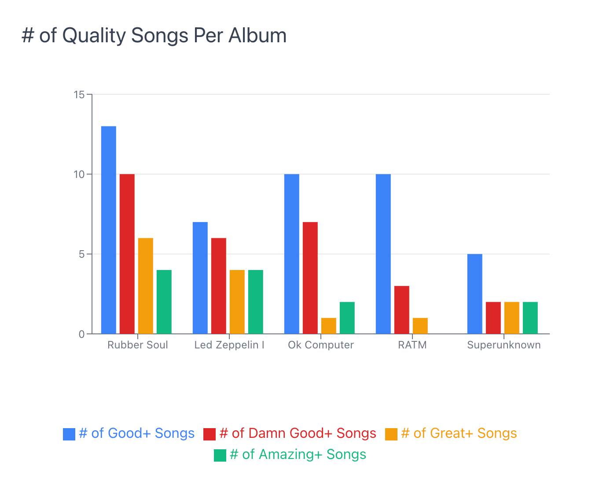
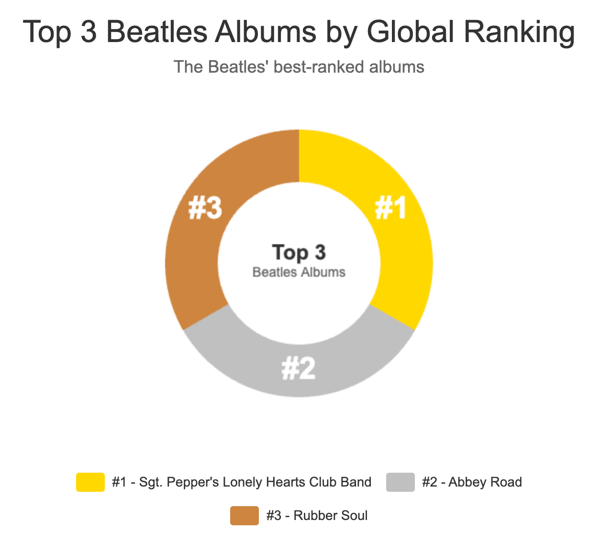

<!-- markdownlint-disable MD025 -->
<!-- markdownlint-disable MD033 -->
<!-- vale Google.Headings = NO -->
<h1>
   Rock-Rankers API
</h1>
<!-- markdownlint-enable MD025 MD033 -->

## Where music meets metrics

Welcome to Rock-Rankers, the ultimate API for rock fans who love data as much as they love music.


## What's Rock-Rankers?

* Rock-Rankers is a lightweight REST API that performs metrics-driven rock music analysis.
* Rock-Rankers scores, ranks, and compares bands, albums, and songs.
* The results are clear, visual, data-driven insights that serious rock fans demand.



## Who uses Rock-Rankers?

Rock-Rankers is for developers building streaming apps and sites for rock fans who love to analyze and debate music.

Empower your fanbase to search for their favorite bands and albums by release dates, album scores/rankings and much more.

For example, need a reminder of the top 3 Beatles albums? Rock-rankers have you covered:

```shell
curl -X GET "http://localhost:3000/albums?name=The%20Beatles&global-album-ranking_gte=1&global-album-ranking_lte=3&_sort=global-album-ranking"
```

**Sample response:**
```json
[
  {
    "id": 6,
    "name": "The Beatles",
    "album": "Sgt. Pepper's Lonely Hearts Club Band",
    "release-date": 1967,
    "album-score": 800,
    "global-album-ranking": 1,
    "band-catalog-album-ranking": 1
  },
  {
    "id": 7,
    "name": "The Beatles",
    "album": "Abbey Road",
    "release-date": 1969,
    "album-score": 805,
    "global-album-ranking": 2,
    "band-catalog-album-ranking": 2
  },
  {
    "id": 1,
    "name": "The Beatles",
    "album": "Rubber Soul",
    "release-date": 1965,
    "album-score": 987,
    "global-album-ranking": 3,
    "band-catalog-album-ranking": 3
  }
]
```



## Quick start

Ready to explore more? Follow this tutorial to set up your rock-rankers environment and
make your first Rock-Rankers call.

* [Get started with Rock-Rankers](./Tutorials/rock-rankers-environment-set-up.md)

## Tutorials

Learn how to perform common Rock-Rankers tasks:

* [How to retrieve band information](./Tutorials/tutorial-get-band.md)
* [How to retrieve album information](./Tutorials/tutorial-get-album.md)
* [How to filter bands with combined query parameters](./Tutorials/tutorial-get-band-filters.md)
* [How to filter albums with combined query parameters](./Tutorials/tutorial-get-album-filters.md)

## Learn more

### API reference docs

 **View Rock-Rankers resource and endpoints**

* [bands](./API/bands.md)
* [albums](./API/albums.md)
* [users](./API/users.md)

**Edit the Rock-Rankers database**  
Rock-rankers supports the following typical `HTTP` functions:

| HTTP Method | Operation | Description |
|-------------|-----------|-------------|
| POST | Create | Create new records |
| PUT | Update | Update an entire record |
| PATCH | Update | Update specific record fields |
| DELETE | Delete | Delete a record |

**Endpoints by Resource**  

**Bands**

* [POST: create a new band](./API/post-band.md)
* [PUT: update an existing band](./API/put-band.md)
* [PATCH: partially update a band](./API/patch-band.md)
* [DELETE: delete a band](./API/delete-band.md)

**Albums**

* [POST: create a new album](./API/post-album.md)
* [PUT: update an existing album](./API/put-album.md)
* [PATCH: partially update an album](./API/patch-album.md)
* [DELETE: delete an album](./API/delete-album.md)

**Users**

* [POST: create a new user](./API/post-user.md)
* [PUT: update an existing user](./API/put-user.md)
* [PATCH: partially update a user](./API/patch-user.md)
* [DELETE: delete a user](./API/delete-user.md)
  
### View the Rock-Rankers repo and OpenAPI specification

* [Rock-rankers api repo](https://github.com/drenn08/rock-rankers-api)
* [View OpenAPI Specification](https://raw.githubusercontent.com/GillWrites/rock-rankers-api/main/api/rock-rankers-spec.yml)

## Contact Rock-Rankers

Ready for an epic music adventure? Rock-rankers would love to hear from you: <hello@rockrankers.com>.
