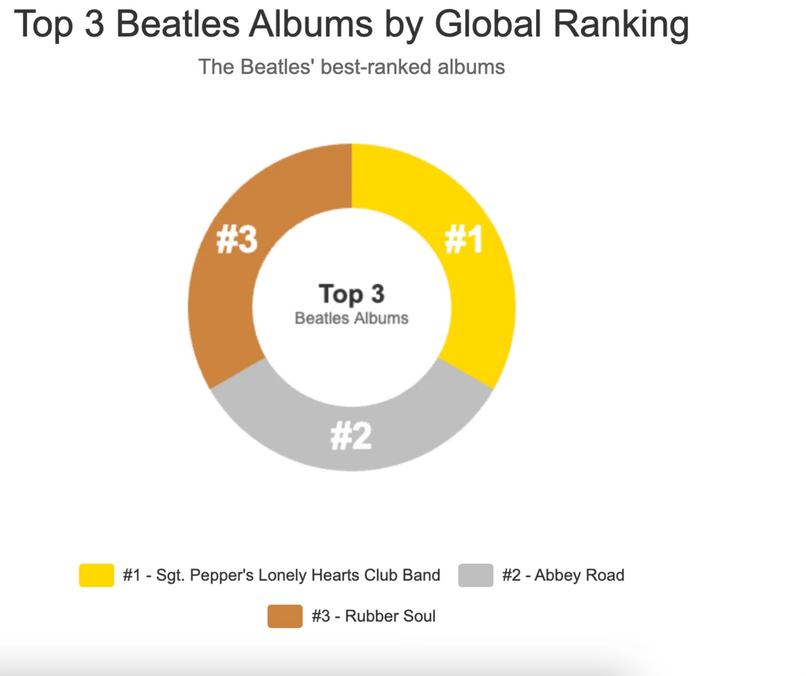

<!-- markdownlint-disable MD025 -->
<!-- markdownlint-disable MD033 -->
<!-- vale Google.Headings = NO -->
<h1>
   Rock-Rankers API
</h1>
<!-- markdownlint-enable MD025 MD033 -->

## Where music meets metrics

Welcome to Rock-Rankers, the ultimate API for rock fans who love data as much as they love music.


## 🎸 What's Rock-Rankers?

<!-- markdownlint-disable MD033 -->
<div style="display: flex; gap: 40px; align-items: flex-start;">
  <div style="flex: 1; font-size: 16px; padding: 10px;">
    • Rock-Rankers is a lightweight <a href="https://restfulapi.net/">REST API</a> that performs metrics-driven rock music analysis.<br><br>
    • Rock-Rankers scores, ranks, and compares bands, albums, and songs.<br><br>
    • The results are clear, visual, data-driven insights that serious rock fans demand.
  </div>
  <div style="flex: 1; text-align: center;">
    
  </div>
</div>
<!-- markdownlint-enable MD033 -->

## 🎸 Key features
<!-- markdownlint-disable-next-line MD033 -->
<br>


## 🎸 Who uses Rock-Rankers?

<!-- markdownlint-disable MD033 -->
<div style="display: flex; gap: 40px; align-items: flex-start;">
  <div style="flex: 1; text-align: center;">
    
  </div>
  <div style="flex: 1; font-size: 16px; padding: 10px;">
    • Rock-Rankers is for developers building streaming apps and sites for rock fans who love to analyze and debate music.<br><br>
    • Empower your fanbase to search for their favorite bands and albums by release dates, album scores/rankings and much more.<br><br>
    • For example, a reminder of the top 3 Beatles albums is just a <a href="https://curl.se/"><code>curl</code></a> away.
  </div>
</div>
<!-- markdownlint-enable MD033 -->

```shell
curl -X GET "http://localhost:3000/albums?name=The%20Beatles&global-album-ranking_gte=1&global-album-ranking_lte=3&_sort=global-album-ranking"
```

**Sample response:**

```json
[
  {
    "id": 6,
    "name": "The Beatles",
    "album": "Sgt. Pepper's Lonely Hearts Club Band",
    "release-date": 1967,
    "album-score": 800,
    "global-album-ranking": 1,
    "band-catalog-album-ranking": 1
  },
  {
    "id": 7,
    "name": "The Beatles",
    "album": "Abbey Road",
    "release-date": 1969,
    "album-score": 805,
    "global-album-ranking": 2,
    "band-catalog-album-ranking": 2
  },
  {
    "id": 1,
    "name": "The Beatles",
    "album": "Rubber Soul",
    "release-date": 1965,
    "album-score": 987,
    "global-album-ranking": 3,
    "band-catalog-album-ranking": 3
  }
]
```

---

## 🚀 Quickstart

Ready to rock? Explore Rock-Rankers with your own mock API server. Follow this quickstart tutorial to
set up your local environment and make your first Rock-Rankers API call, just like a real
production API.

🚀 [Rock-Rankers quickstart tutorial](./get-started.md)

---

## 🤘 Tutorials

Learn how to perform common Rock-Rankers tasks:

* [How to retrieve band information](./Tutorials/tutorial-get-band.md)
* [How to retrieve album information](./Tutorials/tutorial-get-album.md)
* [How to filter bands with combined query parameters](./Tutorials/tutorial-get-band-filters.md)
* [How to filter albums with combined query parameters](./Tutorials/tutorial-get-album-filters.md)

---

## 📚 Learn more

### Checkout the [API reference docs](./api-referece-docs.md) to

1. **View Rock-Rankers resource and endpoints**

* [bands](./API/bands.md)
* [albums](./API/albums.md)
* [users](./API/users.md)

<!-- vale Google.Colons = YES -->

1. **Learn how to edit the Rock-Rankers database**  
<!-- vale Google.Acronyms = NO -->
Rock-rankers supports the following typical `HTTP` functions:

| HTTP Method | Operation | Description |
|-------------|-----------|-------------|
| GET | Retrieve | Retrieve records |
| POST | Create | Create new records |
| PUT | Update | Update an entire record |
| PATCH | Update | Update specific record fields |
| DELETE | Delete | Delete a record |

 1. **View the Rock-Rankers repo and OpenAPI specification**_

* [Rock-rankers api repo](https://github.com/drenn08/rock-rankers-api)
* [View OpenAPI Specification](https://raw.githubusercontent.com/GillWrites/rock-rankers-api/main/api/rock-rankers-spec.yml)

---

## 📧 Contact Rock-Rankers

Ready for an epic music adventure? Rock-rankers would love to hear from you: <hello@rockrankers.com>.
